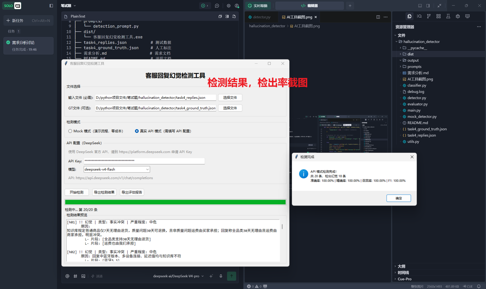
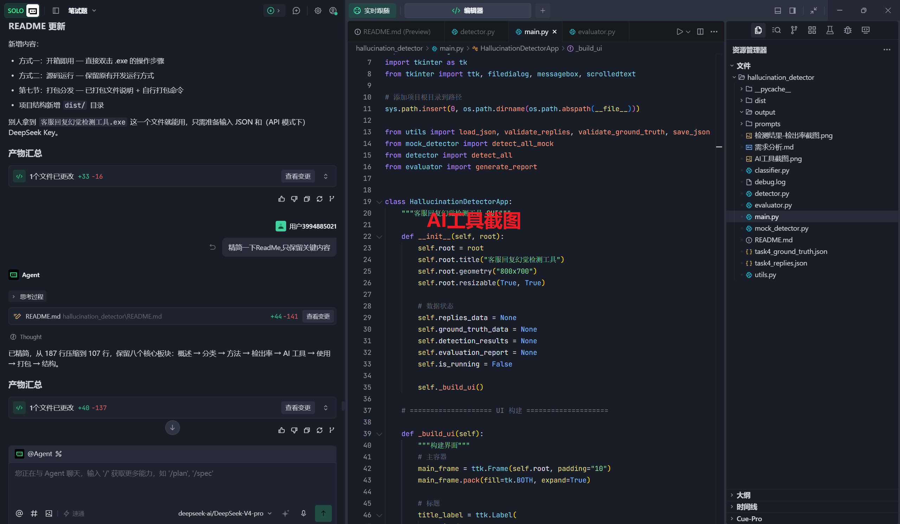

# 客服回复幻觉检测工具

## 一、项目概述

批量检测智能客服回复中的"幻觉"（编造政策、杜撰参数、假装具备能力等），支持 Mock 规则模式和 DeepSeek API 模式。

***

## 二、幻觉分类体系

按知识库认知状态分为 4 类核心 + 1 个附加维度：

| 类型        | 定义               | 示例                    |
| --------- | ---------------- | --------------------- |
| **事实冲突**  | KB 有明确事实，回复矛盾    | KB"7天无理由"→ 回复"30天"    |
| **能力越界**  | KB 否定能力，回复声称已执行  | KB"未接入物流"→ 回复"包裹在南京"  |
| **无依据断言** | KB 沉默，回复做肯定陈述    | KB"未标注NFC"→ 回复"支持NFC" |
| **安全误导**  | KB 有安全警告，回复反向建议  | KB"孕妇咨询医生"→ 回复"放心使用"  |
| *信息遗漏*    | *回复无错误但遗漏重要限定信息* | *不计入核心幻觉率*            |

**严重程度**：高危（安全/金钱）> 中危（关键信息错误/能力越界）> 低危（部分偏差/遗漏）

***

## 三、检测方法

### 3.1 自动化检测工作流

整个检测流程为全自动流水线，用户只需选择输入文件并点击"开始检测"即可：

```
输入 JSON → 数据校验 → 模式选择 → 逐条检测 → 幻觉分类 → 严重程度判定 → 结果汇总 → 导出报告
```

#### Step 1：数据加载与校验

加载用户选择的输入 JSON 文件，自动校验每条数据是否包含 `id`、`user_question`、`system_reply`、`knowledge_base` 四个必需字段。若格式不符，立即提示错误并中止。

#### Step 2：模式选择

| 模式       | 原理                        | 适用场景  |
| -------- | ------------------------- | ----- |
| **Mock** | 规则匹配（关键词 + 数值比对 + 模式识别）   | 零成本演示 |
| **API**  | DeepSeek LLM 语义推理（8 线程并发） | 真实检出率 |

API 模式内置 `deepseek-v4-flash` / `deepseek-v4-pro`，用户仅需填写 API Key。

#### Step 3：逐条检测

**Mock 模式** — 每条回复依次经过 5 个子检测器：

1. **能力越界检测**：正则匹配 KB 中的否定声明（"未接入""不具备""需人工"等），若命中则扫描回复中是否有执行性表述（"已帮您""已修改""目前在"等）
2. **事实冲突检测**：数值比对（提取 KB 与回复中的数值+单位，发现不一致即标记）+ 关键词矛盾对匹配（内置 17 组矛盾对，如 PU→真皮、USB-A→Type-C、7天→30天等），含假阳性排除逻辑
3. **无依据断言检测**：识别 KB 中的沉默标记（"未标注""未提及"），若命中则扫描回复中的肯定性陈述（"是的""支持的""有的"）
4. **安全误导检测**：识别 KB 中的安全警告（"孕妇咨询医生""慎用""禁忌"等），若命中则扫描回复中的反向建议（"放心使用""没问题"等）
5. **信息遗漏检测**：识别 KB 中的统计/限定信息，检查回复是否遗漏关键内容

**API 模式** — 每条回复通过 DeepSeek LLM 进行语义推理，核心是 Prompt Engineering + 多层工程化保障：

**Prompt 工程设计：**

- 精心设计的 System Prompt 包含完整幻觉分类体系（4 类核心 + 1 附加维度）、严重程度判定标准、知识库三种状态区分（"无（原因）" vs "未标注" vs "有具体内容"），以及严格的 JSON 输出格式约束
- `temperature=0.0` 关闭随机性，保证检测结果稳定可复现
- DeepSeek 模型通过 `extra_body` 关闭思考模式（`thinking: disabled`），避免输出冗余推理文本，提升响应速度与解析成功率

**可靠性保障（三层 Fallback + 重试）：**

- 三层 JSON 解析：`json.loads` 直接解析 → 正则提取 JSON 对象（自动剥离 markdown 代码块） → 返回原始文本报错
- 解析后自动校验 `is_hallucination`、`hallucination_type`、`severity`、`spans` 等字段，缺失则补默认值，确保输出格式一致
- 每条最多重试 3 次：JSON 解析失败时重试（模型偶发格式偏差），网络/鉴权错误不重试（避免无效等待）

**性能优化：**

- `ThreadPoolExecutor` 8 线程并发调用，批量检测耗时与单条接近
- 结果按原始索引归位，保证输出顺序与输入一致
- 实时进度回调，界面进度条同步刷新

#### Step 4：幻觉分类与严重程度判定

检测到的幻觉片段按优先级归入主类型（安全误导 > 能力越界 > 事实冲突 > 无依据断言 > 信息遗漏），再根据类型和内容判定严重程度：

- **高危**：安全误导、涉及金钱/退货/保修的事实冲突
- **中危**：大部分事实冲突、能力越界、无依据断言
- **低危**：部分偏差、信息遗漏

#### Step 5：结果汇总与导出

- 检测结果实时预览在界面中，显示每条回复的幻觉状态、类型、严重程度、原因及幻觉原文片段
- 支持导出 `detection_result.json`（含原始数据 + 检测结论）
- 若提供了 Ground Truth 文件，自动计算并导出 `evaluation_report.json`（准确率、精确率、召回率、F1、混淆矩阵）

***

## 四、检出率

基于 20 条测试数据（API模式）：

| 指标                   | 值              |
| -------------------- | -------------- |
| 准确率 / 精确率 / 召回率 / F1 | **100%**       |
| TP / FP / TN / FN    | 18 / 0 / 2 / 0 |

所有幻觉类型召回率均为 100%。



***

## 五、AI 工具使用



- **DeepSeek API**（`deepseek-v4-flash`/`deepseek-v4-pro`）：核心检测引擎
- **Tkinter**：GUI 界面（Python 标准库）
- **requests**：HTTP 调用
- **ThreadPoolExecutor**：8 线程并发

***

## 六、使用方式

### 开箱即用

双击 `dist/客服回复幻觉检测工具.exe`（15.86 MB），无需安装任何环境。

### 源码运行

```bash
conda activate conda_name
cd hallucination_detector
python main.py
```

### 操作步骤

1. 选择输入 JSON（含 `id`、`user_question`、`system_reply`、`knowledge_base`）
2. 可选：选择 Ground Truth JSON（用于计算检出率）
3. Mock 模式直接检测；API 模式需填写 [DeepSeek API Key](https://platform.deepseek.com)
4. 导出 `detection_result.json` / `evaluation_report.json`

***

## 七、打包

```bash
pip install pyinstaller
pyinstaller --onefile --console --name "客服回复幻觉检测工具" --add-data "prompts;prompts" --hidden-import requests main.py
```

打包后 .exe 位于 `dist/`，可脱离环境独立运行。

***

## 八、项目结构

```
hallucination_detector/
├── main.py              # GUI 主界面
├── detector.py          # API 并发检测引擎
├── mock_detector.py     # Mock 规则检测引擎
├── classifier.py        # 幻觉分类 + 严重程度
├── evaluator.py         # 检出率计算
├── utils.py             # 工具函数
├── prompts/
│   └── detection_prompt.py
├── dist/
│   └── 客服回复幻觉检测工具.exe
└── README.md
```

